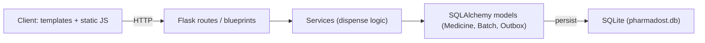

## Architecture

## Core business rule

- sellable_stock is computed as: `sum(batch.quantity)` for batches where `expiry_date >= today` AND `quarantined is False` AND `quantity > 0`.
- Rationale: expired stock is retained for historical audit and tracing (inventory history), but is not sellable or usable for dispensing. Deleting expired rows loses audit/history and can hide why stock levels changed.

## FEFO vs FIFO

- The system uses FEFO (First-Expiry-First-Out) — batches are consumed in order of `expiry_date` (earliest expiry first). This reduces the risk of dispensing soon-to-expire stock and minimizes waste. FIFO (insertion/order of arrival) does not account for differing expiry dates and is therefore less safe for medicines with variable shelf lives.

## Expired vs Quarantined

- Expired is a computed state derived from `expiry_date < today`.
- Quarantined is an explicit stored boolean on `Batch` used to hold batches taken out of circulation for operational reasons (recalls, quality flags). Treating them separately allows quarantining non-expired batches (e.g., recalled) while still computing expiry from date.

## Implemented twists

- T1: Reorder notifications (Outbox) — implemented. After a successful dispense the `sellable_stock` is recomputed; if it drops below `Medicine.reorder_threshold` an unresolved Outbox entry is created (one per medicine until resolved).
- T2: Inventory Clock (`POST /api/clock`) — implemented. Quarantines expired batches and reports expiring-soon counts.
- T4: Messy batch import — not implemented yet in this branch. (Planned: `/batches/import` with normalization, parsing, dedupe and reporting.)

Trade-off: both the `/api/clock` endpoint and the Outbox table are synchronous and in-process. This keeps the design simple and testable, but it means background processing is manual (POST /api/clock) and notifications are stored rather than pushed. A production-grade implementation would use an async worker (e.g., Celery + Redis or task queue) and push notifications; the current approach is a pragmatic trade-off for a single-process, dependency-light demo.

## Debugging journey

- During development the code evolved (added `Batch.in_date`, then `Medicine.reorder_threshold`, etc.). The on-disk SQLite file (`pharmadost.db`) lagged behind model changes. This produced `OperationalError: no such column: batch.in_date` and similar schema errors.
- Resolution: for local/dev use we recreate the DB by deleting `pharmadost.db` and restarting the app so `db.create_all()` and the seed script run and create the expected schema. This is documented in README. For production, a proper migration tool (Alembic / Flask-Migrate) should be used instead.

## Known limitations

- Status badges: the CSS provides a neutral pill-style layout for status text; per-status colored badges (red/orange/green/grey) would require either template markup (span classes) or a tiny JS mapping to add classes. This was intentionally avoided in the visual-only pass.
- Outbox is stored in the DB and polled via an endpoint; there is no email/SMS/push pipeline implemented.
- Clock is a manual POST endpoint; there is no scheduler configured.
- The sellable stock computation iterates batches in Python for `sellable_stock` sorting; this avoids complex SQL but could be slow if the dataset grows very large.

## Tests and verification

- The repository includes tests (pytest) that exercise key behaviors: batch validation, FEFO dispensing, expiry alerts, clock behavior, outbox creation, and search. Run `pytest -q` to verify.

## Final notes

- The project favors clarity, testability, and minimal dependencies. For production readiness, add migrations, background workers, and a notification delivery channel.
This document records design decisions, architecture, and reasoning for Pharmadost.

Problem understanding
- Build a small full-stack pharmacy stock manager that supports batches, FEFO dispensing, expiry alerts, search, pagination and authentication.

Architecture decisions
- Flask with server-rendered templates keeps frontend minimal and avoids extra build steps.
- SQLite for simplicity; SQLAlchemy ORM for ease of use.

Database design
- `User` for authentication.
- `Medicine` for medicines.
- `Batch` for batches linked to a medicine with expiry_date and quantity.

FEFO algorithm
- Query non-expired batches ordered by `expiry_date` ascending and consume from earliest expiry first until quantity satisfied. Use DB transaction to avoid race conditions.

Expiry handling
- Sellable stock uses batches with `expiry_date >= today`.

Authentication
- JWT (Flask-JWT-Extended) with password hashing via Werkzeug.

Search, pagination, sorting
- Basic query params implemented on `GET /api/medicines` supporting `search`, `page`, `limit`, `sort`, `order`.

Testing
- Pytest tests cover registration/login, creation flows, FEFO behavior, expiry alerts and search.

Trade-offs and future improvements
- Frontend is intentionally minimal; could migrate to SPA for richer UX.
- No role-based permissions or audit logs; these could be added.
